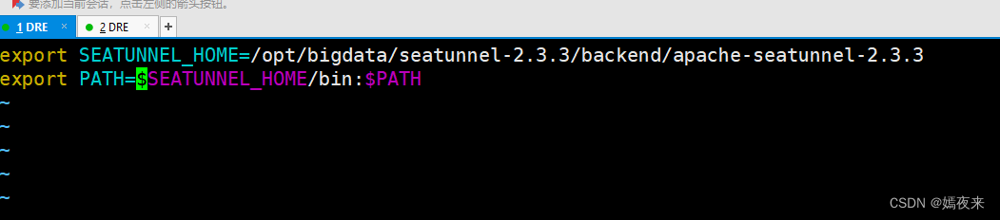

## 下载安装包
进入SeaTunnel下载页面 下载最新版本的二进制安装包seatunnel-<version>-bin.tar.gz
然后解压 
ar -xzvf "apache-seatunnel-${version}-bin.tar.gz"
## 下载连接器插件
sh bin/install-plugin.sh -- 直接安装
sh bin/install-plugin.sh 2.3.9  --指定版本安装
指定下载插件
你可以修改plugin_config配置文件，如下所示：

--seatunnel-connectors--
connector-fake
connector-console
--end--
在/etc/profile中配置环境变量

export SEATUNNEL HOME=/opt/bigdata/seatunnel-2.3.3/backend/apache-seatunnel-2.3.3
export PATH $SEATUNNEL HOME/bin:$PATH
