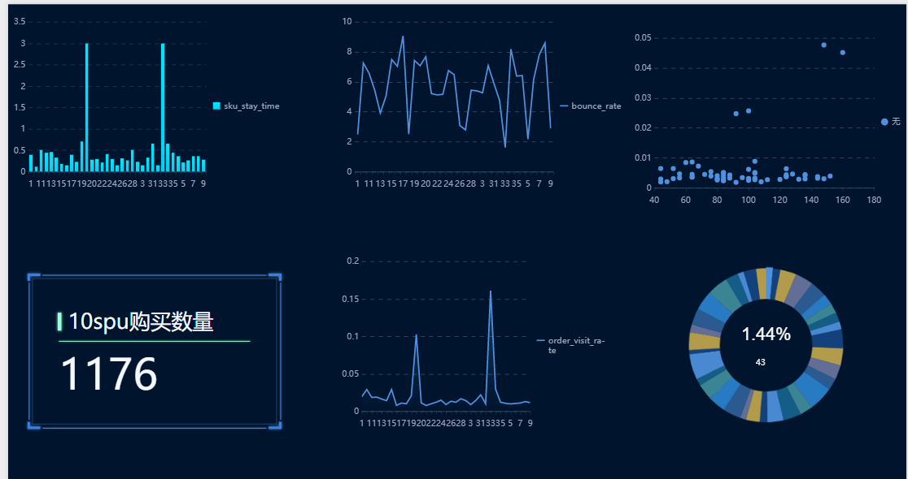
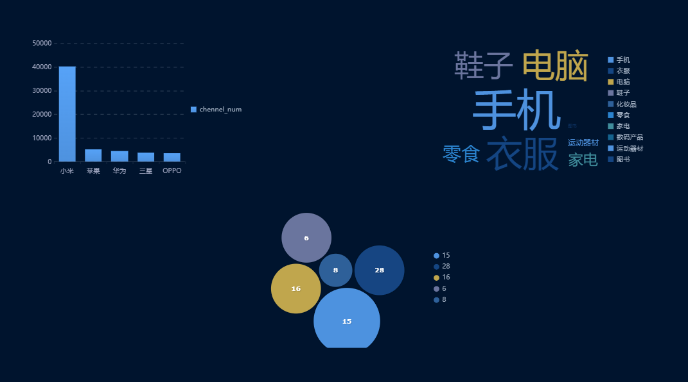

指标：

商品访客数：统计周期内访问宝贝详情页的去重人数，一个人在 统计时间范围内访问多次只记为一个。所有终端访客数为 PC 端 访客数和无线端访客数相加去重。 

 商品浏览量：在统计周期内，商品详情页被浏览的次数累加 

 有访问商品数：统计周期内有浏览的商品数累加 

 商品平均停留时长：来访您店铺的所有访客总的停留时长/访客 数，单位为秒，多天的人均停留时长为各天人均停留时长的日均 值。 

 商品详情页跳出率：统计时间内，访客在详情页中没有发生点击 行为的人数/访客数，即 1-点击详情页人数/详情页访客数。该值越低越好。 

 商品收藏人数：统计日期内，新增点击收藏商品的去重人数，不 考虑取消收藏的情况。 

 商品加购件数：统计日期内，新增点击商品加入购物车的商品件 数总和，不考虑删除、加购件数修改和下单转化减少的情况。 

 商品加购人数：统计日期内，新增点击商品加入购物车的去重人 数，不考虑删除、加购件数修改和下单转化减少的情况。 

 访问收藏转化率：统计时间内，收藏人数/访客数，即访客转化 为收藏用户的比例。 

 访问加购转化率：统计时间内，加购人数/访客数，即加购客户 转化为支付买家的比例。 

 下单买家数：统计时间内，拍下宝贝的去重买家人数，一个人拍 下多件或多笔，只算一个人。所有终端下单买家数为 PC 端和无 线端下单买家去重人数，即同一个人既在 PC 端下单，又在无线 端下单，所有终端下单买家数记为 1。 

 下单件数：统计时间内，商品被买家拍下的累计件数。 

 下单金额：统计时间内，商品被买家拍下的累计金额。 

 下单转化率：统计时间内，下单买家数/访客数，即来访客户转 化为下单买家的比例。 

 支付买家数：统计时间内，完成支付的去重买家人数，预售分阶 段付款在付清尾款当天才计入内；所有终端支付买家数为 PC 端 和无线端支付买家去重人数，即统计时间内在 PC 端和无线端都对商品完成支付，买家数记为 1 个。特别说明，不论支付渠道是 电脑还是手机，拍下为电脑上，就将该买家数计入 PC 端支付买 家数；拍下为手机或 Pad 上，就将该买家数计入无线端支付买家 数。 

 支付件数：统计时间内，买家完成支付的商品数量，如出售手机， 16G 两个，32G 一个，那么支付件数为 3。 

 支付金额：买家拍下后通过支付宝支付给您的金额，未剔除事后 退款金额，预售阶段付款在付清当天才计入内，货到付款订单确 认收货时计入内。所有终端的支付金额为 PC 端支付金额和无线 端支付金额之和。特别说明，支付渠道不论是电脑上还是手机上， 拍下为电脑上，就将后续的支付金额计入 PC 端；拍下为手机或 Pad 上，就将后续的支付金额计入无线端。额计入 PC 端；拍下 为手机或 Pad 上，就将后续的支付金额计入无线端。 

 有支付商品数：统计周期内有支付的商品数累加 

 支付转化率：统计时间内，支付买家数/访客数，即来访客户转 化为支付买家的比例。 

 支付新买家数：统计时间的最小统计日期前 365 天内无支付行为 的买家，在统计时间内有过至少一次购买行为的买家数。 

 支付老买家数：统计时间的最小统计日期前 365 天内有过支付行 为的买家，在统计时间内有过至少一次购买行为的买家数。 

 老买家支付金额：统计时间的最小统计日期前 365 天内有过支付 行为的买家，在统计时间内的累计支付金额客单价：统计日期内，支付金额/支付买家数，即平均每个支付 买家的支付金额。 

 成功退款退货金额：统计时间内，买家成功退款金额，退款包括 售中和售后的仅退款和退货退款。（不包含货到付款的退款金额） 

 聚划算支付金额：统计时间内，通过参加聚划算活动产生的支付 金额，未剔除事后退款金额，预售阶段付款在付清当天才计入内， 货到付款订单确认收货时计入内。 

 年累计支付金额：自然年初截止昨日买家拍下后通过支付宝支付 给您的金额，未剔除事后退款金额，预售阶段付款在付清当天才 计入内，货到付款订单确认收货时计入内。 

 访客平均价值：统计时间内，支付金额/访客数，即平均每个访 客可能带来的支付金额，建议参考此指标控制流量引入成本。 

 竞争力评分：统计时间内，通过流量获取、流量转化、内容营销、 客户拉新、服务质量等能力综合判断得分 

 商品微详情访客数：统计周期内浏览商品微详情 3 秒及以上的去 重人数，一个人在统计时间范围内访问多次只记为一个。
 ## 报表示例

1.商品平均停留时长： 数据上游是dwd层的日志统计表 dwd_product_visit_log, 所有访客总的停留时长/访客数，单位为秒
2.商品详情页跳出率： 数据上游是dwd层的日志统计表dwd_product_visit_log, 直接统计每个商品id的跳出率
3.x轴是有支付的商品数, y轴是支付转换率 查看有支付的商品数和支付转换率的关系 上游数据是dwd层的order_detail和
4.spu购买数量, 每个spu种类的购买数量，上游数据是dwd层的order_detail和sku_info
5.下单转化率：统计时间内，下单买家数/访客数，即来访客户转化为下单买家的比例。上游数据是dwd层的order_info和dwd层的dwd_product_visit_log 日志表
6. 商品收藏人数：统计日期内，不同商品的收藏人数。

7. 渠道top5：流量最高的5个渠道 上游数据是dwd层的渠道表;
8. 关键词top10：搜索量最高的10个关键词 上游数据是dwd层的关键词表;
9. sku的top5：购买数量最高的5个sku 上游数据是dwd层的order_detail表;
