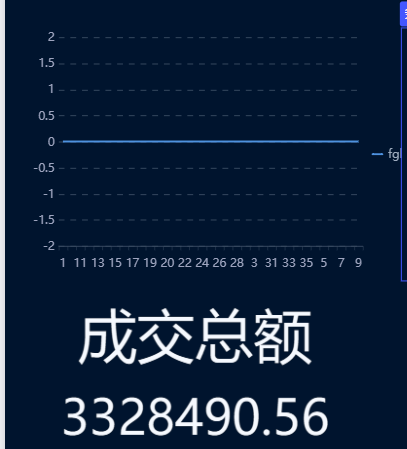
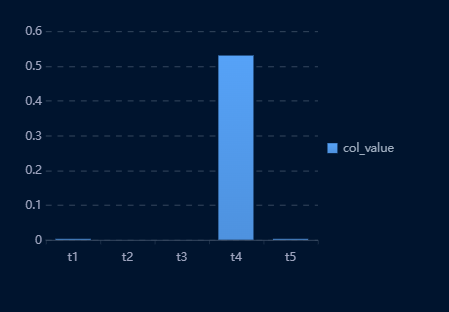

使用sqoop将数据从mysql导入hdfs 然后导入ods层表中

ODS层构建：创建电商业务相关的表：
ods_order_info、ods_order_detail、ods_sku_info、ods_user_info。

要求：按天分区 数表过程自主使用数据存储格式、压缩格式。 列的分隔使用’\t’。 指定存储位置为 ‘/warehouse/gmall/ods/表名’ 数据加载到ODS层表

DWD层构建：创建DWD层的积压对ODS层数据进行判空过滤。
主表：订单详情表dwd_order_detail
相关表：  订单表 dwd_order_info  用户表dwd_user_info 商品表（增加分类）dwd_sku_info

创建dwd_order_detail、dwd_order_info、dwd_user_info、dwd_sku_info表,要建表过程自主使用数据存储格式、压缩格式该表需要按天分区 列的分隔使用’\t’ 指定存储位置为 ‘/warehouse/gmall/dwd/表名’
编写HQL语句向DWD层用户行为宽表 查询主表和相关表，显示数据加载成功
DWS层构建：结合ADS层指标构建DWS层宽表
ADS层构建：GMV成交总额 （gmv=销售额+取消订单金额+拒收订单金额+退货订单金额。），转化率（用户行为漏斗分析）），品牌复购率（复购率计算分析）

gmv成交总额的上游数据是dws层的成交总额，再上游是从dwd_order_info中求sum(amount)得来的

复购率是从dws层中获取的，dws中的数据是从select order_type,sum(`if`(num>2,1,0))/count(*)  from (
select id,order_type,count(*)num
from dwd_user_info group by order_type, id
)a
group by order_type;得来的，因为数据量过少，所以复购率均为0;

转换率 订单不同状态的转换率，从dws中的订单各个状态数量的统计表中相除得出，再上层是dwd_order_info表的订单状态和订单id;
